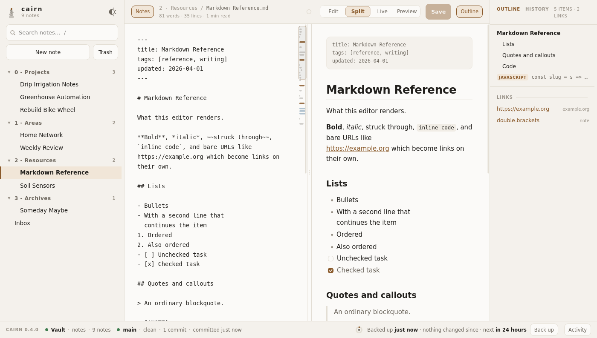
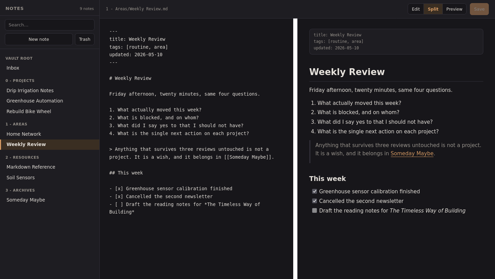

# cairn

A small browser editor for a folder of markdown notes. Two files, the Python
standard library and git: no dependencies to install, no build step, no
internet. Every save is a commit, so every version of every note is in
`git log` — and in the History panel beside the note.

Three things, kept apart on purpose:

| | Where | What it is for |
| --- | --- | --- |
| **The vault** | This machine, a plain folder | The notes you are editing. Local, always. |
| **git** | Inside the vault | Every version of every note, a branch per browser, and the merge when two of them edit at once. |
| **Backups** | Somewhere else — Proton Drive, a disk | A zip and a git bundle of the whole thing, on a schedule. Written, never read back. |

The vault does **not** live in Proton Drive. Backups go there; the notes stay
here. cairn says so in the footer, loudly, if it finds the vault inside a
provider's folder.



The screenshot is the demo vault in `docs/demo-vault/` — nine invented notes,
not anyone's real ones. You can run the editor against it yourself:

```bash
cp -r docs/demo-vault /tmp/cairn-demo
python3 notes-server.py --vault /tmp/cairn-demo
```

(The copy is because cairn keeps the vault's history in a git repository of
its own, and `docs/demo-vault` is inside this one.)

It follows the system theme, and the button beside the wordmark overrides it
when the machine is set the other way. Here it is in dark, in **live** mode —
the note is rendered except for the block the caret is in, which shows its
markdown:



## Run

```bash
python3 notes-server.py --vault ~/Documents/notes
```

Opens on `127.0.0.1:8765`. Markdown source on the left, rendered on the
right, `Ctrl-S` saves straight to the `.md` file on disk — and commits it.
The first start makes the vault a git repository if it isn't one already and
says so; git is the one thing that has to be installed.

Reachable from another machine on the same network:

```bash
python3 notes-server.py --vault ~/Documents/notes --lan --tls
```

`--lan` accepts outside connections; `--tls` encrypts them with a
self-signed certificate. Use them together — without `--tls` the notes and
the login token cross the network in the clear.

| Flag | Meaning |
| --- | --- |
| `--vault PATH` | Which notes folder to serve. Also read from `$NOTES_VAULT`. |
| `--lan` | Accept connections from other devices. Off by default. |
| `--tls` | Encrypt with a self-signed cert, kept in the state directory. |
| `--host ADDR` | Bind a specific address instead of `--lan`'s `0.0.0.0`. |
| `--port N` | Default 8765. |
| `--state-dir PATH` | Where trash and the TLS cert go. Default: a per-vault folder under `~/.local/state/cairn/vaults/`. |
| `--new-token` | Discard the saved token and issue a new one, logging out every device. |
| `--no-browser` | Don't open a browser on start. |
| `--terminal-cwd PATH` | Where "open in terminal" starts. Default `~/workspace`. |
| `--no-terminal` | Never open a terminal window. |
| `--backup-dir PATH` | Where backups of the whole vault go — a Proton Drive folder, an external disk. Must be outside the vault. Also read from `$CAIRN_BACKUP_DIR`. |
| `--backup-every N` | Hours between automatic backups. Default 24; `0` for the button only. |

## The window

Four parts, three of which you can put away:

| Part | What's in it | Toggle |
| --- | --- | --- |
| Left | The vault as a tree. Folders come from the note paths, remember whether they were shut, and open themselves when you follow a link into one. Search flattens nothing — it filters and opens everything that matched. | `Ctrl/⌘-B` |
| Middle | Source, preview, both, or **live** — see below. `Ctrl/⌘-\` cycles them. | — |
| Right | Two tabs. **Outline**: the open note's headings, one entry per fenced code block, and every link it contains. Clicking an entry moves the preview *and* the caret to that line; scrolling the preview moves the highlight. **History**: every commit that touched this note, newest first — click one to read that version and put it back in the editor. | `Ctrl/⌘-E` |
| Bottom | Always on. Left to right: where the vault is, the repository cairn keeps the notes in, and the backups. | — |
| Activity | Inside the footer: every line of every command cairn has run, as it runs. | `Ctrl/⌘-J` |

## Every note has an address

A note is a page: opening one puts it in the address bar as
`/n/<its path in the vault>`, so the back and forward buttons walk the notes
you have read, a note can be bookmarked, and a link to one can be pasted into
another program and will open that note. Rows in the tree, the wikilinks in
the preview and the links in the outline are ordinary links — middle-click or
`Ctrl/⌘-click` opens one in a new tab, and "copy link address" gives an
address that works.

A note page asks for the token like any other, and unlocking lands on the note
that was asked for rather than the front page.

## Live mode

The fourth button in the middle. The note reads exactly as the preview does,
one rendered block at a time, until the caret lands in a block — that one
shows its markdown instead, tinted, with a bar in the margin. So the raw text
is only ever where you are working, and the rest of the note stays readable
while you work on it.

Click anywhere in the note to edit there; the caret lands roughly where you
clicked, not at the start of the block. `Escape` closes the block back to
rendered. Arrow off the top or the bottom of a block and the next one opens,
so the caret walks the note the way it would in a plain editor. The outline on
the right opens blocks too.

Block, not line: a paragraph is three lines that render as one thing, and
there is no half-rendered paragraph to put a raw line inside. List items are
cut one per block though, so fixing one bullet does not turn the whole list
into source.

There is still only one copy of the text. The block being edited splices its
own lines back into the same textarea the other modes use, so saving, the
conflict check, the outline and `Ctrl-S` all carry on reading the note they
always did — and switching modes mid-edit keeps everything you typed.

## The footer

Three questions, left to right: where are the notes, what is git doing with
them, and when did a copy last leave this machine.

**The vault.** The folder being served, and whether that is a sensible place
for it. Green means what it should mean: the notes are on this machine, in a
plain directory, and nothing else is writing them behind cairn's back.

Red means the vault is inside a provider's sync folder — Proton Drive,
iCloud, Dropbox. cairn finds that by looking at the path, names the provider,
and says why it is a problem: the provider's client and cairn will both write
these files with no idea about each other, and the one that finishes last
wins — including over a merge cairn has just made. The startup banner says
the same thing. Move the vault out, and point `--backup-dir` at the provider
instead.

**Git.** The vault is a git repository and cairn owns it. On the first start
it creates one if there isn't one and commits anything that was already lying
around. After that every save, every new note and every delete is a commit —
one per action, no batching, on one branch (`main`, or whatever the vault was
already on). The chip shows the branch, whether the tree is clean, how many
commits there are, how many browsers are editing, and when the last one
landed.

The vault has to be the repository's root. If it sits *inside* someone else's
repository, cairn says so and stops rather than moving branches that aren't
its to move.

Whatever hooks the repository has stay armed, and cairn never passes
`--no-verify`. If a `pre-commit` hook refuses a commit — the vault this was
built for has one that blocks credential-shaped strings — the save is refused
with it: nothing is written, the hook's own words appear in a banner above the
editor, and your text is still in the textarea to fix.

**Backups.** When a copy of the whole vault last went somewhere else, and what
has changed since. See below.

## Two browsers, one note

Every browser session that connects gets a branch of its own,
`client/<browser>-<id>`. It is a bookmark rather than a workspace — there is
one folder on disk and one branch checked out — and it marks the commit that
session has seen. That is enough to do the two jobs it exists for.

**Telling you.** When another device saves, the browsers that are behind get a
line above the editor: *2 notes changed on another device — including this
one*, with the paths and a Reload. It is measured in commits, not guessed from
a clock, and Reload keeps anything unsaved in your textarea.

**Merging.** A save carries the commit its copy came from. If the vault has
moved on, cairn three-way merges your edit against what is there now — the
same thing a pull request does, done in the half-second of a save rather than
in a branch someone has to remember to open. Two people working on different
parts of a note never notice.

**When it can't.** If you both changed the same lines, nothing is written.
The two versions come back with the clashing hunks split out, and the editor
shows them side by side: **keep yours**, **keep the vault's**, **keep both**,
or edit the result by hand, one hunk at a time. What you save is an ordinary
save on top of the version that beat you — so there is no half-merged state
anywhere, and if you close the dialog instead, your text is exactly where you
left it.

Both versions stay in `git log` whatever you pick.

## History

The second tab on the right. Every commit that touched the open note, newest
first, with the browser that made it. Click one to read that version rendered,
and **Restore into the editor** puts its text back in the textarea — not
saved, not committed, just there, so restoring is an edit you look at before
you keep it.

Entirely `git log` and `git show` on the server. Nothing in this panel writes.

## Backups

A backup is a copy of the whole vault written somewhere else. It is storage:
cairn writes backups and never reads one back.

```bash
python3 notes-server.py --vault ~/Documents/notes \
    --backup-dir ~/ProtonDrive/cairn-backups
```

Each run writes three files with one timestamp:

| File | What it is |
| --- | --- |
| `cairn-<vault>-<stamp>.zip` | Every note and attachment, openable by anything. |
| `cairn-<vault>-<stamp>.bundle` | The whole git history in one file. `git clone that.bundle notes` gives you the vault back, every version intact. |
| `cairn-<vault>-<stamp>.json` | Which commit it was taken at, and how big. |

The zip is the copy a person can read without git; the bundle is the one that
still has every version in it. The manifest is what lets the footer say what
has changed since — it names a commit, so *3 notes changed since your last
backup* is `git diff` against that commit, not a guess from timestamps. If the
newest backup in the folder is from a history this vault does not have, cairn
says it cannot tell rather than printing a number that means nothing.

They happen every 24 hours (`--backup-every`, `0` to turn the schedule off)
and whenever you press **Back up**. The dial beside it fills as the next one
comes due. Anything uncommitted in the vault is committed first, so the zip
and the bundle agree with each other.

The destination is fixed at startup and no request can name one: `/api/backup`
reads nothing from its body. cairn refuses to start if the backup directory
and the vault are inside one another.

## Activity

Everything cairn runs, in the panel above the footer. A backup's git commands
and their output arrive as they happen rather than in one lump at the end, so
a slow bundle shows you where it has got to. Merges, conflicts and opening a
terminal from a code block each leave a line here too. It is this process's
own record and lives in memory: restarting the server empties it.

## Code blocks

Hovering a fenced code block shows two buttons. **copy** puts it on the
clipboard. **terminal** opens a real terminal window on the machine running
the server, at `~/workspace`, with the command typed at the prompt and *not
executed* — you still read it and press Enter yourself. Change where it opens
with `--terminal-cwd`, or turn it off with `--no-terminal`.

The command is never handed to a shell for evaluation. It is written to a file
and read back with `$(cat)`, and the text a command substitution yields is
never re-parsed as shell syntax. It then goes into the *line editor* rather
than the shell: under bash by a readline macro, which types characters and
cannot press Return for you, and under zsh by `print -z`. So a code block full
of quotes and semicolons arrives as text rather than as instructions.
Multi-line blocks land as one editable buffer.

`$SHELL` decides which — a Mac on the stock shell gets zsh, not a surprise
bash prompt. Either way the window is yours: it reads the startup files your
terminal would have read, so your prompt, your `PATH` and your aliases are
all there. (Which files those are is a question about the terminal, not the
shell: Terminal.app opens a login shell, Linux emulators do not.)

On Linux the first installed emulator wins, in roughly desktop-native order
(`konsole`, `gnome-terminal`, `kitty`, `alacritty`, … down to `xterm`). On
macOS it opens Terminal.app. `$CAIRN_TERMINAL` overrides both — a binary name
on Linux, an application name on macOS:

```bash
CAIRN_TERMINAL=iTerm python3 notes-server.py --vault ~/Documents/notes
```

The button only appears for shell-ish blocks (` ```bash `, ` ```sh `, or no
language at all), only when the browser is on the same machine as the server —
a phone on the LAN is still authenticated, but it isn't sitting in front of
the screen the window would open on — and only if a terminal was found. The
startup banner names the one it will use.

## Access

A token is generated on first run, kept in the state directory and printed
in the terminal. Opening the printed URL on the same machine logs you in.
From another device you open the plain URL and paste the token once; the
server sets an `HttpOnly; SameSite=Strict` session cookie and the token
never appears in a URL, in history, or in the page source.

The token survives a restart, so a device you pair once stays paired — you
are not retyping it on the phone every time the server comes back. It lives
at `token` in the state directory, mode `600` in a `700` directory, the same
as the TLS private key beside it. `--new-token` throws it away and issues a
fresh one, which logs out every device.

With `--tls` the certificate is self-signed, so a browser warns until you
install it. Do that once per device and the warning stops for good. On the
device itself, open `/cert` on the server:

```
https://<address-or-name>:8765/cert
```

and trust the file it downloads — macOS Keychain Access, or iOS Settings →
General → VPN & Device Management, followed by Certificate Trust Settings.
The banner prints that URL, the path of the file on this machine, and the
certificate's SHA-256 fingerprint; check the fingerprint before you trust
it. After that the device connects cleanly and you type nothing.

`/cert` needs no token. It serves the certificate the server already hands
to anyone who opens a TLS connection to it, so it publishes nothing that
connecting does not — and it is the only way onto a device that has no
shell and no copy of the state directory. The private key is served by no
route.

The certificate covers `localhost`, `127.0.0.1`, this machine's mDNS name
(`<hostname>.local`) and every non-virtual LAN address it has. VPN tunnels,
libvirt bridges and container interfaces are deliberately excluded — an
address only this machine can reach is worse than useless in a certificate.
On start the server checks the existing certificate still covers all of
those and regenerates it if not, so a new DHCP lease fixes itself. A
regenerated certificate has to be trusted again on each device, which is
why the mDNS name is in there: reach cairn by name and the lease can move
without invalidating anything.

## What protects your files

- Binds `127.0.0.1` unless `--lan` is passed explicitly.
- Every request needs the token; cross-origin requests are refused outright.
- Writes are atomic (temp file, then `os.replace`).
- A save and its commit are atomic: both, or neither. A commit the repository
  refuses leaves the file byte-for-byte as it was, with nothing staged and
  nothing recorded.
- Every version of every note is in `git log` and in the History panel, so a
  bad edit is one click away. Deleting also moves the file to `trash/` in the
  state directory — an undelete button for a wrong click, next to a history
  that keeps the record.
- Two browsers editing one note is a merge, not a lost edit. When it can't be
  merged, nothing is written at all until you have picked a side.
- Backups are written, never read: no restore path can be triggered from the
  browser, and no request can say where a copy of the vault goes.
- The state directory is *outside* the vault, so deleted notes and the
  `--tls` private key stay out of anything that copies the vault. Older
  vaults with `.backups/`, `.trash/` or `.certs/` inside them are moved out on
  the next start; the banner says where.
- Every git command is a fixed argv list run in the vault: no shell, and
  nothing from a request body is ever an argument.
- A save that cannot be merged is refused rather than resolved for you.
- Paths are resolved against the vault root; only `.md` files can be written.
- Opening a terminal is refused for anything but a browser on this machine,
  and it types the command rather than running it.

## Versions

`python3 notes-server.py --version`, and the footer's left-hand corner says
the same thing. Not a release process — a number that moves when the editor
does, so a screenshot, a bug report and a running server can be talked about
as the same thing.

- **0.4** — sync and backup pulled apart. A branch per browser, a three-way
  merge behind every save, conflicts settled hunk by hunk in the page, a
  History panel, and backups as a zip and a git bundle written somewhere
  else. The `origin` remote, `--sync-cmd`'s replacement and `--sync-timer`
  are gone; the vault is local.
- **0.3** — the vault is a git repository cairn owns: a commit per save, a
  branch per machine, and Sync merges them. `.backups/` and `--sync-cmd` are
  gone.
- **0.2** — controls drawn on canvas, the tree, the outline, the footer,
  live mode.
- **0.1** — the three-pane editor.

## What it is not

Single-user, single-vault, for a network you control. No accounts, no real
rate limiting, no audit trail beyond the terminal. Don't port-forward it.

## Markdown support

The renderer in `editor.html` is deliberately small and covers what these
notes use: headings, fenced code, inline code, bold/italic/strikethrough,
links and bare URLs, `[[wikilinks]]` and `![[embeds]]`, bullet, numbered and
task lists, tables, blockquotes, `> [!NOTE]` callouts, horizontal rules, and
YAML frontmatter. Footnotes and nested blockquotes are not handled.

`docs/demo-vault/2 - Resources/Markdown Reference.md` exercises most of it.

## Tests

```bash
python3 tests/test_server.py
```

Checks over auth, reading, writing, path safety, TLS, opening a terminal, the
git repository, merging, backups, and the footer's own endpoints — including a
hook that refuses a save, two browsers editing one note into a merge and then
into a conflict, a backup bundle restored with a plain `git clone`, and a
throwaway vault inside a folder named the way Proton Drive names its own.
Standard library only. It builds a throwaway vault in `/tmp` and never touches
a real one. No terminal window is opened during the tests: a shim records what
the server tried to launch, and the shell part is driven under a pty, which is
where a hostile code block is proved to be typed rather than run.

The same suite runs in a container, against a machine with nothing on it:

```bash
podman build -t cairn-ci . && podman run --rm cairn-ci
```

The image is a bare Debian plus `python3`, `git`, `openssl` and `bash` — the
whole of what cairn needs and nothing else. That is the point of it: a test
that quietly leans on something your laptop happens to have installed fails
here. cairn itself does not want a container to run, and the image is not a
way to run it.

GitHub Actions runs both on every push and pull request — the container, and a
stock runner with no setup step at all, because "clone it and run it" is a
claim worth checking. There is nothing to deploy: cairn runs on the machine
you cloned it onto, so CI ends at a green tick.
